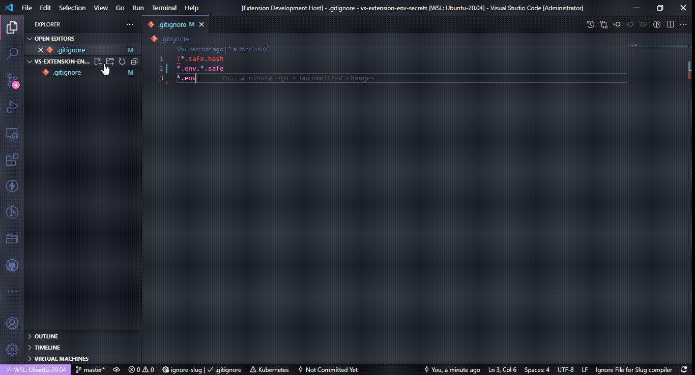

# Make your env files safe in repository

> [raphaelcarlosr.dev](https://raphaelcarlosr.dev)

[](https://github.com/raphaelcarlosr/vscode-safe-env/issues?logo=visual-studio-code)
[](https://github.com/raphaelcarlosr/vscode-safe-env/blob/main/LICENSE)

[](https://github.com/raphaelcarlosr/vscode-safe-env/stargazers)


 

## The Problem

Environment files ```".env"``` cannot stored in repository because has sensitive data

```env
SAME_VAR=SAME_VALUE
ANOTHER_VAR=1292949
```

## The Solution

### Register two file types

- Safe Environment Variables ```.env.safe```
- Safe Environment Variables Hash ```.env.safe.hash```

When you edit your environment files with ```.env.safe``` file extension, is generated hash file based on imputed secret

```env
SAME_VAR=SAME_VALUE
ANOTHER_VAR=1292949
```

### The hash file ```.safe.hash``` content

```plaintext
U2FsdGVkX1+h7bi6Y2jezLUeE0vSHyqbdAt67bTG+cYD7QTuzt3p2cYMcmV2Gozg
```

### You can store this hash in your repository using ```.gitignore``` file

```git
!*.safe.hash
*.env.*.safe
*.env
```

### Reuse it when you need, in your CI/CD pipeline or with same others developers, just share the pass-phrase

## How its works

The flow is very simple:

- If you saving a safe file ```.env.safe```
- Get the pass phrase to that file (if not stored in [vs code secrets](https://code.visualstudio.com/api/references/vscode-api#SecretStorage))
- Encrypt file content with ```AES``` from [crypto-js](https://www.npmjs.com/package/crypto-js)
- Generate new ```.safe.hash``` file with encrypted content

## How to decrypt file content

Open the ```.safe.hash``` file and run command ```env-safe.decrypt``` Decrypt safe file

## How to delete stored pass phrase

Open the ```.safe.hash``` file and run command ```env-safe.deletePhrase``` Delete stored secret of file

## Custom env file extension

The extension support env files with the following name:

- ```.env.safe```
- ```.env.safe.hash```

To enable support for other env files with specific naming convention/ file extension, use the ```files.associations``` settings in Visual Studio Code.

For example, the following settings will enable support for
```*.env.safe.development``` and ```*.env.safe.production``` files:

```json
  "files.associations": {
    "*.env.safe.development": "env.safe",
    "*.env.safe.hash.development": "env.safe.hash",
    "*.env.safe.production": "env.safe",
    "*.env.safe.hash.production": "env.safe.hash"
  }
```

## Requirements

- Node >10
- [crypto-js](https://www.npmjs.com/package/crypto-js)

## License

This project is licensed under the terms of the [MIT license](https://github.com/raphaelcarlosr/vscode-safe-env/blob/master/LICENSE).

## Release Notes

Users appreciate release notes as you update your extension.

### 1.0.0-beta

- Initial release